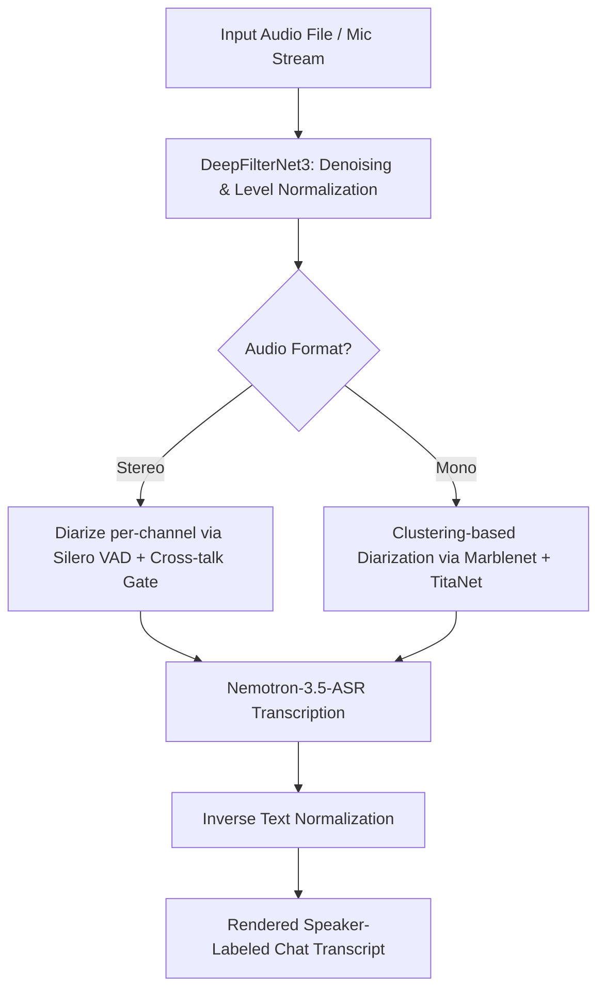

# Nemotron Streaming ASR Lab

Welcome to the **Nemotron Streaming ASR Lab**! This project provides a local test harness and web interface for advanced Speech-to-Text (STT) technologies. It integrates **NVIDIA Nemotron-3.5-ASR-Streaming-0.6b**, **DeepFilterNet3** for audio denoising, and **offline NeMo telephony diarization** (speaker separation).

---

## 🚀 Yes, There is a Web UI!

You **do not** need to test this system solely using API tools like Postman or cURL. The project includes a fully built, interactive frontend web application!

When the FastAPI server is running, you can access the web application by opening:
👉 **`http://localhost:8000`** (or your server's host IP/port) in your web browser.

### What you can do in the Web UI:
1. **Record Audio**: Use your browser's microphone directly.
2. **Upload Audio Files**: Upload custom `.wav`, `.mp3`, or other audio recordings.
3. **Run Preloaded Samples**: Choose from a list of pre-configured audio samples in the repository.
4. **Interactive Dashboard**: View real-time or processed results showing segmented speaker turns (Customer vs. Agent), raw transcripts, Normalized text (using ITN backend options), and word hit summaries for Context Biasing (names, brands, etc.).

---

## 📁 Repository Structure

Here is a quick overview of what each file in this repository does:

```
test_nemotron/
├── app.py                  # The main FastAPI server entry point. Exposes web UI, WebSocket, and REST endpoints.
├── audio_processing.py      # Core audio operations: conversion to 16kHz mono PCM, and DeepFilterNet3 noise reduction.
├── biasing_context.py      # Utilities for dynamic phrase context biasing (boosting names/brands) and language checks.
├── diarize_inventory.py    # Pipeline logic for speaker turn segmentation, Silero VAD gating, and cross-talk handling.
├── eval_hindi_biasing.py   # Script to evaluate ASR accuracy & biasing effectiveness using Hindi datasets.
├── nemotron_streaming.py   # Interface to NVIDIA Nemotron streaming ASR, handling chunk-based transcription caching.
├── pipeline.py             # Orchestrates the execution flow (Denoise -> Diarize -> ASR -> ITN) and manages models.
├── streaming_handler.py    # Manages high-performance WebSocket stream receiving and live output generation.
├── transcript_render.py    # Formats raw Nemotron hypothesis objects into clean readable transcripts.
├── static/                 # Web UI assets:
│   ├── index.html          # Web page structure (interactive workspace, audio recorder, and results pane)
│   ├── style.css           # Styling for the web interface
│   └── app.js              # Frontend logic (WebSockets, file uploads, audio visualizer, rendering)
├── recording/              # Directory for sample audio recordings (.mp3, .wav)
├── docker-compose.yml      # Docker Compose configuration for easy containerized multi-GPU setup.
├── Dockerfile              # Container building instructions.
└── requirements.txt        # Python dependency manifest.
```

---

## ⚙️ Prerequisites & Setup

This repository uses deep learning models that run on NVIDIA GPUs. For best performance, the system is designed to use CUDA-visible GPUs.

### Option A: Running with Docker Compose (Recommended)

Docker Compose automatically configures system libraries (like FFmpeg, libsndfile) and handles dependencies cleanly.

1. Ensure you have the **NVIDIA Container Toolkit** installed on your host.
2. Build and start the container:
   ```bash
   docker compose up --build
   ```
3. Open `http://localhost:8000` in your browser.

---

### Option B: Local Installation (Virtual Environment)

1. **Install System Dependencies** (Ubuntu/Debian example):
   ```bash
   sudo apt-get update
   sudo apt-get install -y ffmpeg libsndfile1-dev libicu-dev libfst-dev build-essential rustc cargo pkg-config
   ```

2. **Set up Python Virtual Environment**:
   ```bash
   python3 -m venv .venv
   source .venv/bin/activate
   ```

3. **Install Dependencies**:
   ```bash
   pip install --upgrade pip
   pip install Cython packaging
   pip install -r requirements.txt
   ```

4. **Run the Server**:
   ```bash
   uvicorn app:app --host 0.0.0.0 --port 8000
   ```
   *Note: On the very first request, the server will download required models (Nemotron-3.5-ASR, DeepFilterNet, Silero VAD), which might take a few minutes depending on your internet connection.*

---

## 🛠️ Testing Guide

### 1. Testing via the Web UI (Easiest)
- Open `http://localhost:8000`.
- **Upload File / Select Sample**: Click "Select a sample" to use one of the preloaded recordings, or drag and drop your own audio file.
- **Configure Options**:
  - Choose the **Language** (defaults to Hindi `hi-IN`).
  - Set **Context Biasing** details if testing names, brands, or monetary amounts (e.g. Name: "Rahul", Brand: "Google").
  - Select the **ITN Backend** (Inverse Text Normalization: converts "ten dollars" to "$10").
- Click **Submit** or **Run ASR** and observe the live transcription and diarized speaker splits on the screen.

### 2. Testing via the API (Postman / Swagger)
If you prefer testing with API calls or Postman:
- Open `http://localhost:8000/docs` in your browser. This will load the interactive **Swagger API Documentation**.
- **Submit a Job (`POST /api/jobs`)**:
  - Parameters: Upload an audio `file`, and supply form parameters (`language`, `itn_backend`, `name`, `brand`, etc.).
  - Returns: A JSON response containing a `job_id`.
- **Check Job Status (`GET /api/jobs/{job_id}`)**:
  - Fetch the processing status and final transcripts.
- **Real-time Streaming (`WebSocket /api/stream`)**:
  - Connect to `ws://localhost:8000/api/stream` to stream raw audio bytes and receive real-time, low-latency transcript packets.

---

## 🧠 Core Pipeline Flow



1. **Audio Pre-processing**: Converts the incoming audio using FFmpeg to 16 kHz mono PCM. Denoises the signal using **DeepFilterNet3** to improve ASR accuracy in noisy environments.
2. **Speaker Diarization**:
   - **Stereo**: Processes channels separately (e.g., agent channel vs. customer channel), applies Silero VAD to detect when people are speaking, and uses a cross-talk filter to drop echo leakage.
   - **Mono**: Cascades multilingual MarbleNet and TitaNet-Large models to cluster audio segments and differentiate speakers.
3. **ASR Model**: Feeds the segmented audio turns to the **NVIDIA Nemotron 0.6B streaming model** running with offline high-fidelity configurations.
4. **ITN Post-processing**: Formats numerical terms, currency, dates, and times into cleaner readable text.
